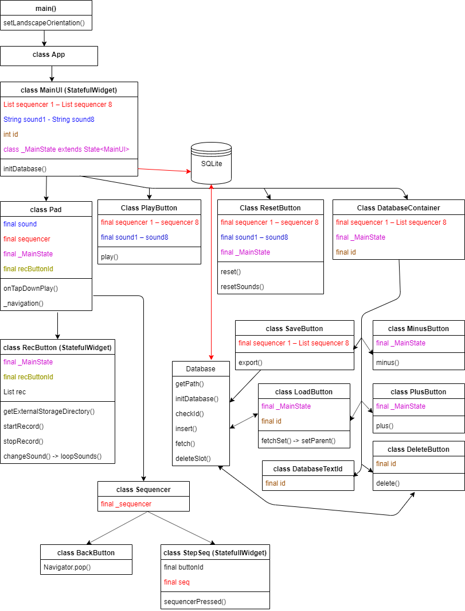

# Drum machine v1.0

Mobile Application development - Harjoitustyö  
Tekijä: Mikko Aro  
Arvosana: 5  
Päivitetty 16.12.2019

## Info

Coded with Flutter + Dart  

Features:

- Play samples (asset/recorded)
- Record audio as .wav to external storage folder
- Make rhythmn patterns with sequencer
- Save rhythmns in SQLite-database
    - 10 slots for saving
    - Save/Load/Delete

Demonstration video link to [youtube](https://youtu.be/twkhECjTBog)

## User Interface

Main screen

Sequencer screen

  

App structure (from Powerpoint presentation)
