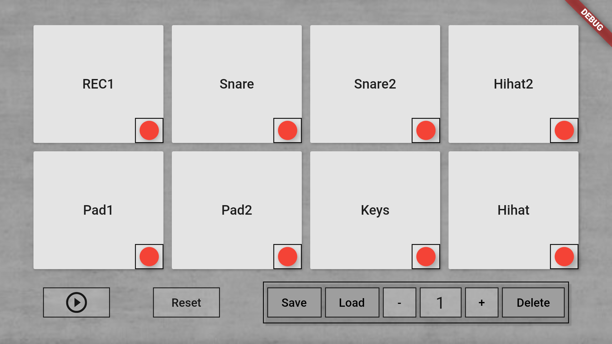

# Drum machine v0.5

Mobile Application development - Harjoitustyö  
Tekijä: Mikko Aro

## Tietoa ohjelmasta

Sovellus on yksinkertainen rumpukone, jota tulen jatkokehittämään vielä *Mobile Project* -kurssia varten vk50 asti.  
Sovelluksella on "soitto"-osio, sekä sekvensseri. Toisinsanoen ensimmäisessä ruudussa voidaan soittaa sovelluksessa olevia rumpuääniä (sampleja), ja toisessa ruudussa voidaan ohjelmoida ohjelma soittamaan kyseiset äänet tietyssä rytmissä.

Sovellus on kehitetty Flutter-mobiilikehitystyökalulla, ohjelmointikielenä Dart.

Linkki demovideoon [youtube](https://www.youtube.com/watch?v=yqxOk7aWAEs).

## Käyttöliittymä

*Kuva: Aloitusnäkymä ("soitto"-osio)*  
Sovelluksen aloitusnäkymässä voidaan soittaa sampleja. Pitkällä painalluksella avautuu toinen ruutu, jossa kyseisen äänen sekvensseri.  

*Kuva: Sekvensserinäkymä*  
Sekvensserinäkymä toimii listana True/False arvoja jotka lähetetään aloitusnäkymään. Ohjelma käy taulukon läpi 120bpm rytmissä ja soittaa samplen mikäli taulukon indeksin arvo on true.  
